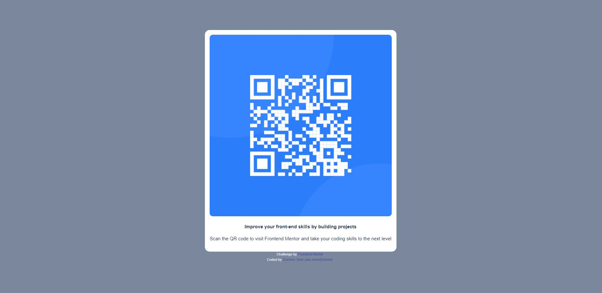

# Frontend Mentor - QR code component solution

This is a solution to the [QR code component challenge on Frontend Mentor](https://www.frontendmentor.io/challenges/qr-code-component-iux_sIO_H). Frontend Mentor challenges help you improve your coding skills by building realistic projects. 

## Table of contents

- [Frontend Mentor - QR code component solution](#frontend-mentor---qr-code-component-solution)
  - [Table of contents](#table-of-contents)
  - [Overview](#overview)
    - [Screenshot](#screenshot)
    - [Links](#links)
  - [My process](#my-process)
    - [Built with](#built-with)
    - [What I learned](#what-i-learned)
    - [Continued development](#continued-development)
    - [Useful resources](#useful-resources)
  - [Author](#author)

## Overview

### Screenshot



### Links

- Solution URL: [GitHub-Repo](https://github.com/AnnoDomine/qr-code-component)
- Live Site URL: [Netlify Live Preview](https://cosmic-entremet-e8f63a.netlify.app/)

## My process

 - Day 1
   - Download assets
   - Initial repo on GitHub
   - Initial templated ReactJS-App with Vite
   - Build all components, styles and hooks.
   - Add assets to the project

 - Day 2
   - Code cleanup
   - Commit and merge
   - Publish on Netlify
   - Finish readme.md
   - Submit solution

### Built with

- Mobile-first workflow
- [React](https://reactjs.org/) - JS library
- [TypeScript]([https://](https://www.typescriptlang.org/)) - Type library
- [Vite](https://vitejs.dev/) - Frontend bundle tool


### What I learned

Better usage of `useMediaQuery`.
Improvment of file structure

_useMobile-hook i build and use_
```js
// packages
import { useMediaQuery } from "react-responsive";

/**
 * Checks the window width and returns true when size is below 720px
 * @returns {boolean}  True if window width belo 720px for mobile view
 */
const useMobile = (): boolean => {
    const isMobile: boolean = useMediaQuery({ maxWidth: 720 });
    return isMobile;
};

export default useMobile;
```

### Continued development

Learn and use different frameworks like Vue and Angular.
Learn new languages like Python for PyScript

### Useful resources

- [react-responsive](https://www.npmjs.com/package/react-responsive) - To easy acces to the media-query. I liked this package and will use it for future projects.

## Author

- Website - [Dominic Seel - Portfolio work-in-never-ending-progress](https://www.dominic-seel.de)
- Frontend Mentor - [@AnnoDomine](https://www.frontendmentor.io/profile/AnnoDomine)

---

I dont like writing readmes :sweat_smile:
